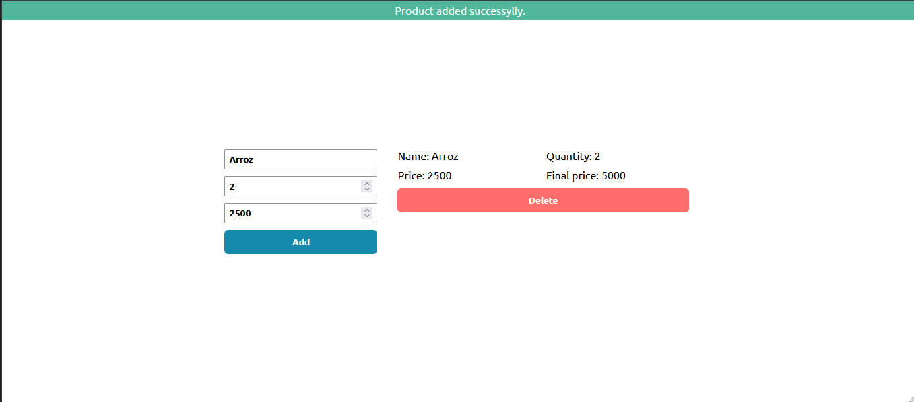
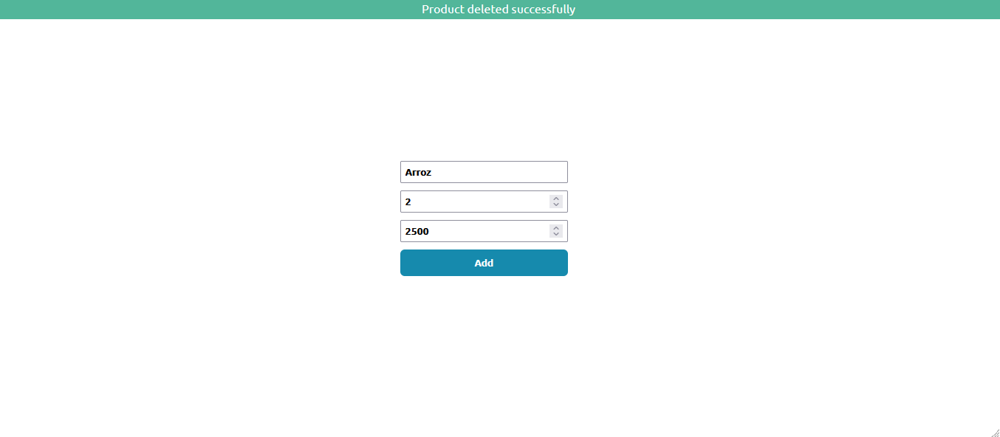
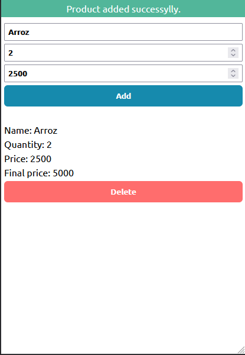
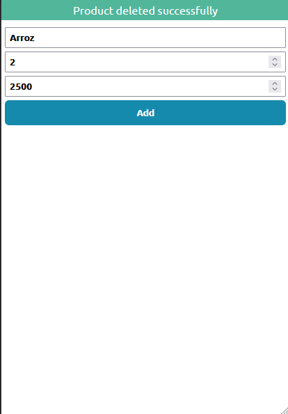

# Products App
This is a package that will let you get the cities of colombia using a department name as paramenter

## Table of contents

- [Overview](#overview)
  - [Screenshot](#screenshot)
  - [Links](#links)
- [Built with](#built-with)
- [Author](#author)

## Overview
JavaScript application created to modulate a shopping list, with the name of the product, the quantity, the price per unit, the price per set and the time of addition. It also includes an option to remove a specific item or the entire list.

### Screenshot

### Links
- Solution URL: [GitHub](https://github.com/ButchBet/products-app)
- Live URL: [Live](https://butchbet.github.io/products-app)

### Built with
- HTML
- Css
- JavaScript
- Mobile First

## Author
- Website - [Butchbet]('https://butchbet.github.io/Personal-Protafolio/')
- Twitter - [@JustButchBet](https://twitter.com/JustButchBet)